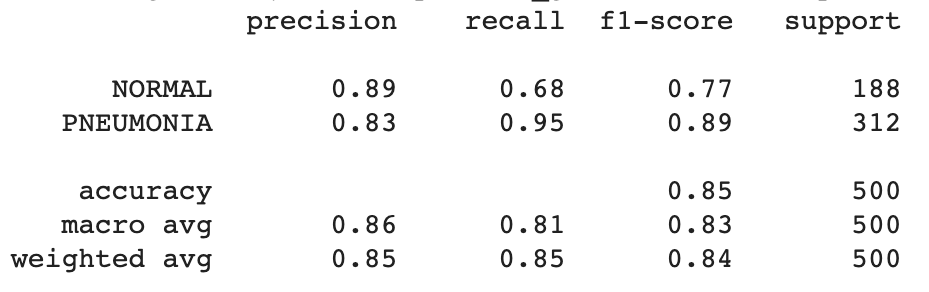
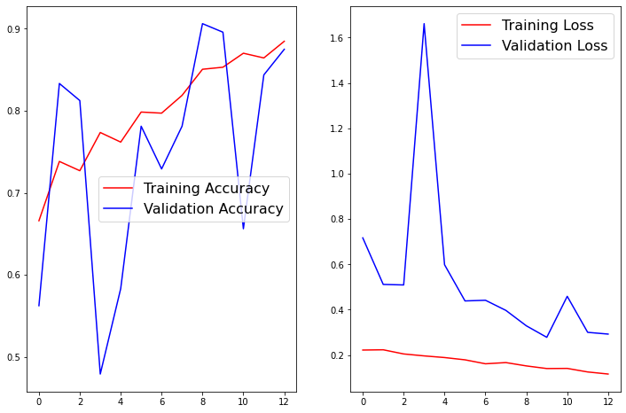

# **Diagnosing Pneumonia using AI: A Convolution Neural Network Model from Chest X-Ray Images**
by Nadir Sarigul

## **I. Overview and Goals**

This report contains a detailed explanation of the extraction, exploration, data preparation and generation of deep learning models for the diagnosis of pneumonia from chest x-ray images. 

Pneumonia is an inflammatory condition of the lung usually caused by infection with viruses or bacteria. Typically symptoms include some combination of productive or dry cough, chest pain, fever, and trouble breathing. Severity is variable, but in severe cases or cases that go undiagnosed pneumonia can cause death. In fact, each year, pneumonia affects about 450 million people globally (7% of the population) and results in about 4 million deaths. However, cases, if the disease is diagnosed and treated in its early stages, pneumonia is largely treatable. Therefore, it is critical to develop better tools that can streamline and improve the diagnosis of pneumonia. The ultimate goal of this project is to build an artificial intelligence model that can be used in clinical settings to diagnose pneumonia and thus improve the efficiency of the healthcare system. 

To be able to better understand this problem and how to solve it, I have divisided this analysis into three questions:

1) Can we distinguish healthy versus pneumonia patients solely by chest x-ray imaging?

2) Can we accuratly predict the diagnosis of pneumonia from chest x-ray images?

3) What x-ray features contribute the most for the incorrect diagnosis of a patient?

## **II. Data Understanding and Exploration**

The dataset used in this analysis/model is available on Kaggle (https://www.kaggle.com/paultimothymooney/chest-xray-pneumonia) and contains a total number of 5863 chest x-ray images from either healthy (normal) or patients diagnosed with pneumonia (pneumonia). The dataset is comprised of three sub datasets: 

- Training dataset (contains 5216 chest x-ray images)

- Test dataset (contains 629 chest x-ray images)

- Validation dataset (contains 16 chest x-ray images)

Here is a count of the number of chest x-ray images ascribed to each diagnosis included in the training dataset:

Before diving into building a complex model capable of accuratly predicting pneumonia, it is important to understand how pneumonia is diagnosed. The most frequently used method to diagnose pneumonia is a chest x-ray. Here is how the chest x-ray images of healthy lungs looks like:

And here is how chest x-rays of pneumonia patients looks like:

When interpreting the x-ray, doctors look for white spots in the lungs (called infiltrates) that identify the infection. Looking at the x-ray images in our datasets we can see that chest x-rays of pneumonia patients show the presence of white spots and the general architecture of the lung is different than of healthy people. Thus, analysis of x-ray images are one of the most reliable ways to effectively diagnose pneumonia.

## **III. Data Preparation for Modeling**

Because the data provided as the validation dataset only contained 16 images, I decided to randomly split the test dataset into data to validate my models (20% of the data corresponding to 124 x-ray images) and data to test my models (80% of the data corresponding to 500 x-ray images). 

To get the x-ray images ready for modeling, I have use the ImageDataGenerator class to load the data and prepare the data for modeling. This is very useful when handling large datasets as it allows for the images to be progressively loaded in batches from file, retrieving just enough data for what is needed immediately.

The constructor for the ImageDataGenerator contains many arguments to specify how to manipulate the image data after it is loaded, including pixel scaling and data augmentation. Thus, also allowing to not configurate the specific details about each image as it is loaded but also expand the training dataset with new, plausible examples. Using this class I scaled the array of pixels in the original images of all my datasets to pixel values between 0 and 1, which a range prefered for neural networks modeling. I also used data augmentation methods including rotation, width and height shifts and zoom to create variations of the training set images that are likely to be seen by the model. 

In addition, I also using the "flow_from_directory" method I also normalized the size of all the images to 64x64. I kept the batch size at 32 (the default size used) and used a binary classification as the datasets only contains two classes (pneumonia or normal).

## **IV. Modeling**

Neural networks algoritms are made out of layers of "neurons" connected in a way that the input of one layer is the ouput of the previous layer. This type of architecture allows neural netoworks the flexibility to represent well the underlying relationships between the tasks input and output. To develop a model capable of taking chest x-ray images and predict if a patient has pneumonia or is healthy, I will use the convolution neural networks (CNN) algorithm. This is based on traditional neural networks but employes a specific architercture type that exploits special properties of an image. CNN first reduces the size of images using convolutional layers and pooling layers to than feed the reduced data to fully connected layers. Thus, to build a CNN we need to compile the model by providing the instructions for each of the hyperparameters within each layer. 

### **Models with Original Data**

#### **1) Baseline Model**
In order to get a sense as to how this dataset would perform through a CNN algorithm, I constructed a CNN model with 3 convolution, 3 pooling (max pooling) and 2 dense fully connected layer using the RMSprop optimzer, the rectified linear activation function and 10 epochs. 

Looking at this model, we can see that the accuracy is 85%, which is pretty good to start with, and has the ability to predict 95% of pneumonia cases. However, its ability to predict healthy x-rays is limited, resulting in a high false positive rate (32%).

#### **2) Model 1**

In order to see if I could improve the baseline model, I added an additional convolution layer and fine-tuned the kernels within the different convolution layers. I also added an additional pooling layers and added 3 additional dense fully connected layers. 

Looking at the results of Model 1 we can see that the CNN architecture that I developed here actually had the opposite effect, as the model became less accurate (from 85% in the baseline model to 80% in this model). The ability to correctly predict pneumonia increased to 99%, however this model has an even harder time recalling normal x-rays with a false positive rate of 52%.

#### **3) Model 2**

Because the changes I made in Model 1 did not improve the ability to accuratly predict the x-ray images, I decided to change a little bit the architecture of the CNN network. This time, I decided to  introduced two dropout layers. Dropout is a technique where randomly selected neurons are ignored during training. The effect is that the network becomes less sensitive to the specific weights of neurons. This in turn results in a network that is capable of better generalization. I added one dropout layer after the convolotion and pooling layers just before flatening the layers into a one dimensional array of features. In addition, I increased the number of dense fully connected layers to 5, and added another dropout layer between the second and the third dense fully connected layers.

Looking at the results it looks like model 2's accuracy is much reduced (62%) with 100% false positive rate,  suggesting that the additions I made to the CNN architecture were actually deterimental to the performance of the model.

### **Models with Balanced Data**

Looking at the confusion matrices for all the models developed so far, it is clear that all three CNN models have trouble distinguising the healthy (normal) x-rays from pneumonia x-rays, thus causing a very high false positive rate. As seen above, the training data that these models are using is greatly imbalanced having about 3 times more pneumonia x-rays than normal x-rays. Imbalances in the number of images in each class will invariably affect how the model performs as it bias the model towards the more abundant class. Because of this, I reasoned that if the classes are more balanced, the models will perform better. To balance the data, I first calculated weight of each class of x-ray images by dividing the number of x-rays images in each class by the total number of images. This show how much one class is represented versus the other. Then I assigned the weight of the pneumonia class to the value of weight that I calculated the normal class to have and vice-versa to equally penalize under or over-represented classes in the training set.  

In addition, a problem with training neural networks is in the choice of the number of training epochs to use. Too many epochs can lead to overfitting of the training dataset, whereas too few may result in an underfit model. In the previous models I had choosen to use 10 epochs, which was a rather arbitrary choice, based on previous experiences. But since the models that I have created thus far could use some improvement, I decided to use an automated method, called early stopping, that allows you to specify an arbitrary large number of training epochs and stop training once the model performance stops improving on a hold out validation dataset. 

Using these alterations, I went back and used the same CNN architecture as before and tested if balancing the data and adding the early stopping callback would be sufficient to improve the models.

#### **1) Baseline Model with Balanced Data**

Balancing the data and implementing the early stop call back definitly improved the baseline model. It's accuracy is only mildly increased (86% from 85%), but the false positive rate is reduced to 26%, suggesting that the imbalance in the original data as in fact introducing bias in the model. 

#### **2) Model 1 with Balanced Data**

Much like what happened with the Baseline Model, Model 1's accuracy was also not greatly affected by these alterations. However, its ability to correctly predict normal x-rays is much higher (from 48% with the original data to 70% with the balanced data). Unfortunatly, the increase in correct detection of normal x-rays came at the cost of reducing the amount of correct pneumonia recalls (from 99% with the original data to 86%).
  

#### **3) Model 2 with Balanced Data**

Model 2, which with the original data had a really poor performance, with the balanced data and early stop callback performs much better. In fact, model 2's accuracy using these settings is the highest of all CNN architectures that I have constructed here (87%) and it has the best performance at recalling correctly normal x-rays while still maintaining a high recall performance for pneumonia x-rays (91%).  

#### **4) VGG16 with Balanced Data**

In addition to the models that I have constructed above, I also implemented the VGG16 architecture to see if it would result is a model with higher performance. VGG16 is a convolutional neural network model proposed by K. Simonyan and A. Zisserman from the University of Oxford in the paper “Very Deep Convolutional Networks for Large-Scale Image Recognition”. 

Looking at the results it is clear that VGG16 is a great model to accuratly predict chest x-rays. Similar to what I obtained with my CNN architecture of model 2, VGG16 also shows a 87% accuracy and it can also distinguish very well between normal and pneumonia x-rays. 

## **V. Model Analysis** 

Looking at all the models, it seems that the best CNN model that I have built is Model 2 run with balanced data and the early stop callback, which is able to predict 91% of pneumonia  while still able to predict a high proportion of normal x-rays (81%). In order to understand the robustness of this model it is also important to look at the loss and accuracy levels after each iteration of optimization. So let's take a look at how behaves in terms of accuracy and loss:

While this has one of the best accuracy of the models that I have built, looking at the accuracy and loss curves it is obvious that the model can be improved to become more robust as there is a high degree of variability both in loss and in accuracy through the different epochs. Fine-tunning of the CNN architecture including fine-tunning of the hyperparameters within each layer of the neural network are likely to yield an improved and more robust model.

To get a sense into what features of the x-ray images were contributing for the improper diagnosis of normal x-rays as pneumonia, I used the Lime package to depict the features that the model found most important in making its predictions. 

The images shown displays the features that the model found the most important in green and the ones found to be less important in red. From this image we can see that the CNN model picked up a large portion of the diaphragm and the sternum as key features in making its incorrect prediction, suggesting that the high intensity pixels coming from these areas may be adding noise to the model. Taking this into consideration, additional pre-processing methods that can remove or supress the intensity of pixels coming from the diaphragm and sternum areas could also be valuable in improving this model for future clinical use.

## **VI.Conclusions**

In conclusion, I was able to develop a deep learning model using convolutional neural network that, albeit not perfect, can accuratly diagnose pneumonia from chest x-ray images. Through the process of building and analysing this model we learned the following:

1) Chest x-ray images can be used to develop AI-based diagnostic models.

2) Chest X-rays are a good tool for the diagnosis of pneumonia.

3) The diaphragm and sternum areas are a source of noise that affects the ability of model to correctly diagnose patients.

These are important information when implementing this or other AI-based tools for pneumonia diagnoses in the clinic. Therefore, for the implementation of this tool in a clinical setting I would recomend it to be implemented as follows:

* Develop a pre-processing tool that removes the noise coming from the diaphragm and sternum areas which is done automatically as part of the x-ray processing.

* Implement the AI model automatically once the x-ray image is generated and processed as a first step in the diagnosis of pneumonia to help inform the radiologist that interprets the x-ray.

This would help speed up the x-ray analysis and increase efficiency within the healthcare system but still require a doctor to make a final diagnosis based on the diagnosis done by the AI model, the doctor's experience and the patient's symptoms. 

